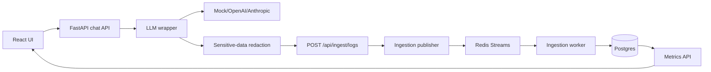

# Architecture

## System Flow

## Chat Flow

1. User sends message from React.
2. FastAPI creates or resumes a conversation.
3. User message is redacted and stored as preview + hash.
4. LLM wrapper emits `request_started`.
5. Wrapper posts lifecycle events to the ingestion API with optional API-key auth.
6. Provider adapter streams chunks through SSE.
7. Wrapper emits token chunk events and one terminal event.
8. Assistant response is redacted and stored as preview + hash.

## Ingestion Flow

1. Ingestion payloads are validated with Pydantic.
2. Optional `x-ingestion-key` auth and in-memory rate limiting run before processing.
3. Payloads are redacted before logs, queues, analytics, traces, or DB writes.
4. Redacted events are stored in `inference_events`.
5. Events are published to Redis Streams.
6. Worker normalizes terminal events into `inference_requests`.
7. Worker sends failed processing attempts to a DLQ stream.
8. DLQ events can be inspected and replayed from the dashboard/API.

## Failure Handling

- Provider failures emit `request_failed`.
- Cancelled generations emit `request_cancelled`.
- Ingestion uses event ids for idempotency at the event table.
- Worker normalization is idempotent by request id.
- Redis failures can fall back to inline normalization for local resilience.
- SDK HTTP ingestion failures can fall back to the internal publisher for local resilience.
- Docker Compose runs Alembic from the backend container before serving traffic; the worker waits for backend health and does not run migrations.
- Kubernetes uses a separate one-shot `llmtrace-migrate` Job before backend/worker Deployments to avoid migration races when replicas scale.
- The local app startup still calls `create_all` as a development/test fallback, but Docker and production-like paths use migrations.

## Scaling Notes

- Redis Streams is a lightweight event bus suited for this scope.
- Postgres is the first analytics store; add partitioning/materialized views before OLAP migration.
- Dashboards are eventually consistent because ingestion normalization is async.
- Provider adapters are intentionally isolated for later SDK extraction.
- Stored conversation context uses redacted previews, not raw messages. This intentionally trades perfect recall for safer default observability.
- Ingestion auth/rate limiting is intentionally lightweight for the assignment; production should replace it with project-scoped auth and distributed rate limits.
