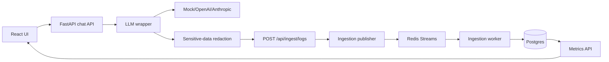
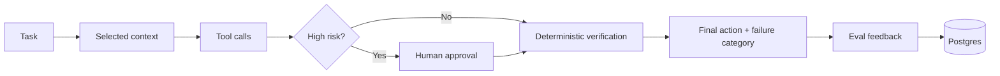

# Architecture

## System Flow

## Harness Flow

The harness layer is intentionally additive. Inference logging answers "what happened during an LLM call?" Harness logging answers "what control loop surrounded an agent action?" The current implementation records agent runs, selected context, tool-call telemetry, verification results, approval decisions, failure categories, and eval cases. It does not execute tools yet; that keeps the assignment focused while making the control-system model visible.

## Chat Flow

1. User sends message from React.
2. FastAPI creates or resumes a conversation.
3. User message is redacted and stored as preview + hash.
4. LLM wrapper emits `request_started`.
5. Wrapper posts lifecycle events to the ingestion API with optional API-key auth.
6. Provider adapter streams chunks through SSE.
7. Wrapper emits token chunk events and one terminal event.
8. Assistant response is redacted and stored as preview + hash.

## Ingestion Flow

1. Ingestion payloads are validated with Pydantic.
2. Optional `x-ingestion-key` auth and in-memory rate limiting run before processing.
3. Payloads are redacted before logs, queues, analytics, traces, or DB writes.
4. Redacted events are stored in `inference_events`.
5. Events are published to Redis Streams.
6. Worker normalizes terminal events into `inference_requests`.
7. Worker sends failed processing attempts to a DLQ stream.
8. DLQ events can be inspected and replayed from the dashboard/API.

## Failure Handling

- Provider failures emit `request_failed`.
- Cancelled generations emit `request_cancelled`.
- Ingestion uses event ids for idempotency at the event table.
- Worker normalization is idempotent by request id.
- Redis failures can fall back to inline normalization for local resilience.
- SDK HTTP ingestion failures can fall back to the internal publisher for local resilience.
- Docker Compose runs Alembic from the backend container before serving traffic; the worker waits for backend health and does not run migrations.
- Kubernetes uses a separate one-shot `llmtrace-migrate` Job before backend/worker Deployments to avoid migration races when replicas scale.
- The local app startup still calls `create_all` as a development/test fallback, but Docker and production-like paths use migrations.

## Scaling Notes

- Redis Streams is a lightweight event bus suited for this scope.
- Postgres is the first analytics store; add partitioning/materialized views before OLAP migration.
- Dashboards are eventually consistent because ingestion normalization is async.
- Provider adapters are intentionally isolated for later SDK extraction.
- Stored conversation context uses redacted previews, not raw messages. This intentionally trades perfect recall for safer default observability.
- Ingestion auth/rate limiting is intentionally lightweight for the assignment; production should replace it with project-scoped auth and distributed rate limits.

## Explored Options and Tradeoffs

### Frontend and Backend Shape

Explored options: a single Next.js fullstack app, a server-rendered admin UI, or a split FastAPI + React app.

Chosen tradeoff: FastAPI + React. It costs more boilerplate, but keeps ingestion, provider adapters, workers, and schema validation independently testable. FastAPI also gives OpenAPI docs without extra infrastructure.

Upgrade path: generate typed API clients from OpenAPI and add stricter API versioning to prevent frontend/backend contract drift.

### Event Bus

Explored options: direct database writes, Redis Streams, NATS, Kafka, or a managed queue.

Chosen tradeoff: Redis Streams. It is lightweight, works in Docker Compose, supports consumer groups, and is enough to demonstrate event-based ingestion. It is weaker than Kafka/NATS for long retention, partitioning, replay tooling, and high-throughput fanout.

Upgrade path: keep the ingestion publisher behind an event-bus boundary and replace Redis with Kafka or NATS when throughput, retention, or replay requirements justify the operational cost.

### Ingestion Processing

Explored options: fully synchronous persistence, fully async fire-and-forget, or synchronous validation/redaction with async normalization.

Chosen tradeoff: synchronous validation/redaction/publish, async worker normalization. The API acknowledges quickly while still guaranteeing sensitive data is redacted before queues and DB writes. The cost is eventual dashboard consistency and the need for idempotency and DLQ handling.

Upgrade path: add richer retry policies, replay UI controls, backpressure metrics, and idempotency keys at the SDK boundary.

### Analytics Store

Explored options: Postgres only, TimescaleDB, ClickHouse, Elasticsearch, or separate OLTP/OLAP stores.

Chosen tradeoff: Postgres first. It keeps the assignment operationally simple and makes conversation/log joins easy. At high event volume, time-series dashboards will need partitioning, materialized views, or an OLAP store.

Upgrade path: add indexes and rollups first, then move hot analytics to TimescaleDB or ClickHouse while keeping Postgres as the system of record.

### Streaming Transport

Explored options: polling, SSE, WebSockets, or provider-specific streaming directly from the browser.

Chosen tradeoff: SSE. It matches one-way token streaming, is simple for browsers, and avoids WebSocket lifecycle complexity. It is not the best fit for collaborative or bidirectional realtime control.

Upgrade path: introduce WebSockets only if the product needs client-driven realtime control, shared sessions, or richer cancellation/control messages.

### Sensitive-Data Handling

Explored options: store raw content, store redacted full content, store redacted previews only, or send all payloads through a semantic classifier before persistence.

Chosen tradeoff: redacted previews + hashes + metadata by default. This reduces risk while preserving debugging value. Regex detection is deterministic and testable, but can miss contextual sensitive data.

Upgrade path: add Presidio/classifier-based detection for high-risk fields, tenant-specific redaction policy, encrypted raw vault opt-in, short TTLs, RBAC, and audit logs.

### Provider Integration

Explored options: direct provider calls in endpoints, in-app adapters, or a separate SDK/package.

Chosen tradeoff: in-app adapters behind a lightweight wrapper. This keeps scope tight while still capturing provider/model/latency/tokens/status/errors/session/previews and posting lifecycle logs to ingestion.

Upgrade path: extract the wrapper and provider adapters into versioned Python/npm SDKs with batching, retries, backoff, and contract tests.

### Harness Observability

Explored options: replace inference logging with agent traces, integrate a full agent runtime, or add harness telemetry as a separate layer.

Chosen tradeoff: additive harness telemetry. It demonstrates the control-system concepts around agents without destabilizing the existing inference logging architecture. The system records runs, context, tool calls, verification, approvals, failure taxonomy, and eval cases, but does not execute tools.

Upgrade path: connect typed permissioned tools, policy enforcement, real approval gates, eval runners, and automated verification loops.

### Kubernetes Scope

Explored options: Docker Compose only, raw Kubernetes manifests, Helm/Kustomize, or a full managed deployment.

Chosen tradeoff: raw self-hosted manifests plus notes. This satisfies deployment-awareness requirements without overbuilding cluster operations. It still lacks production-grade secrets, TLS automation, dashboards, alerts, backups, rollout strategy, and runbooks.

Upgrade path: Helm/Kustomize, External Secrets, ingress TLS, HPA tuning, Grafana dashboards, alerts, backups, and documented rollback procedures.
